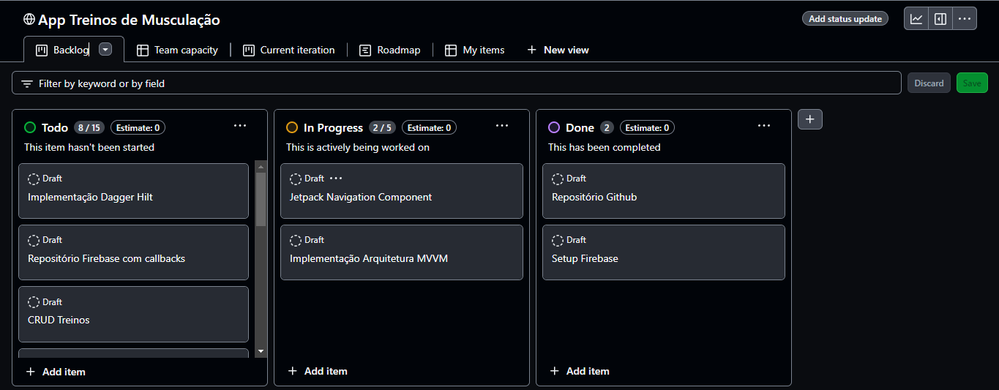

# Seu Treino App

## Requisitos funcionais
### Gerenciamento de Treinos:
- [x] Deve ser possível criar um treino*
  - [x] Definir nome, descrição e exercícios do treino.*
  - [x] Salvar os treinos em um banco de dados Firebase Firestore.*

- [x] Deve ser possível visualizar treinos existentes.*
  - [x] Listar todos os treinos criados.*
  - [x] Visualizar os detalhes de cada treino.*
  - [ ] Filtrar e pesquisar treinos por nome ou data.

- [x] Deve ser possível iniciar um treino*
  - [x] Cada quantidade de tempo de um treino deve passar por um countdown, até completar todos os treinos

- [x] Deve ser possível excluir treinos existentes.*
  - [x] Remover um treino completo da lista de treinos no banco de dados.*

### Gerenciamento de Exercícios:
- [x] Deve ser possível criar um exercício*
  - [x] Definir nome, descrição e imagem(opcional).*
  - [x] Salvar os exercícios em um banco de dados Firebase Firestore.*

- [x] Deve ser possível visualizar exercícios existentes.*
  - [x] Listar todos os exercícios criados.*
  - [x] Visualizar os detalhes de cada exercício.*
  - [ ] Filtrar e pesquisar exercícios por nome.

- [x] Deve ser possível editar exercícios existentes.*
  - [x] Modificar qualquer informação de um exercício.*
  - [x] Salvar alterações no banco de dados.*

- [x] Deve ser possível excluir exercícios existentes.*
  - [x] Remover um exercício completo da lista de exercícios no banco de dados.*

### Associação de Treinos e Exercícios
- [x] Ao criar um treino, permitir que o usuário selecione exercícios da lista de exercícios criados.
- [x] Salvar a associação entre o treino e os exercícios selecionados no banco de dados.
- [x] Ao visualizar um treino, mostrar a lista de exercícios associados a ele.

## Regras de negócio
- [ ] Não deve ser possível criar um treino sem a existência de exercícios.
- [ ] Ao criar um treino, o usuário deve selecionar pelo menos um exercício da biblioteca de exercícios.
- [ ] A quantidade de exercícios por treino é limitada (5 exercícios por treino).

## Organização
